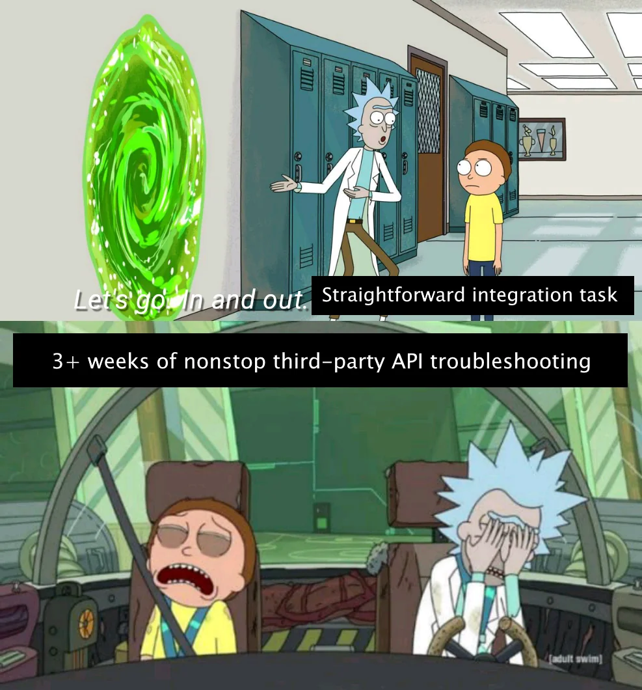
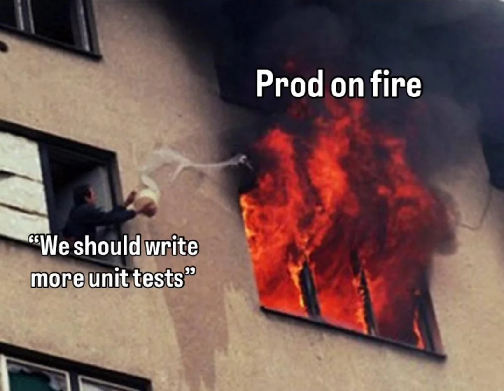
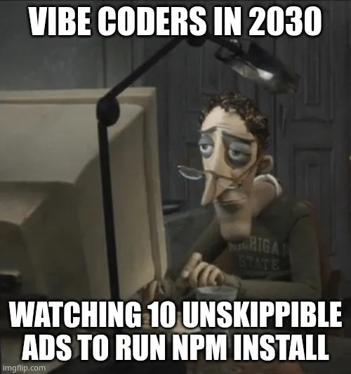
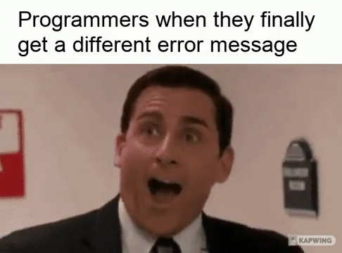
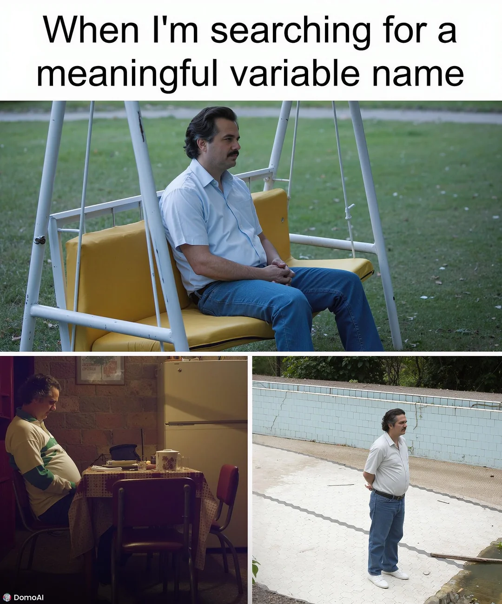
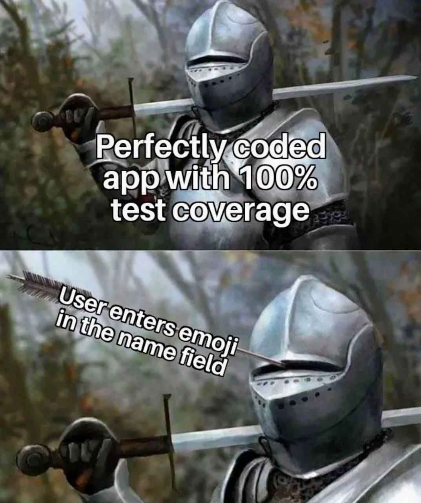
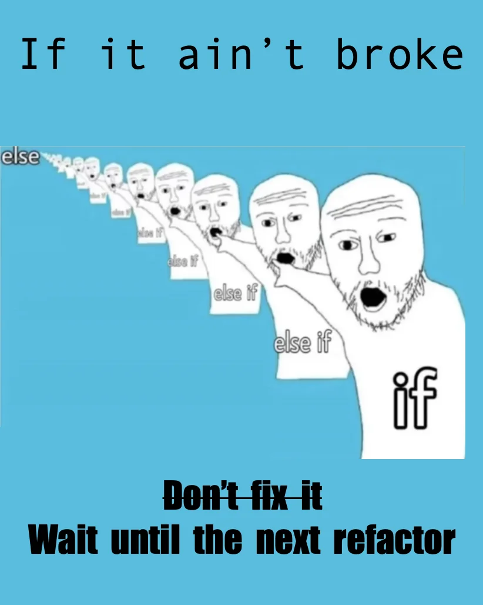
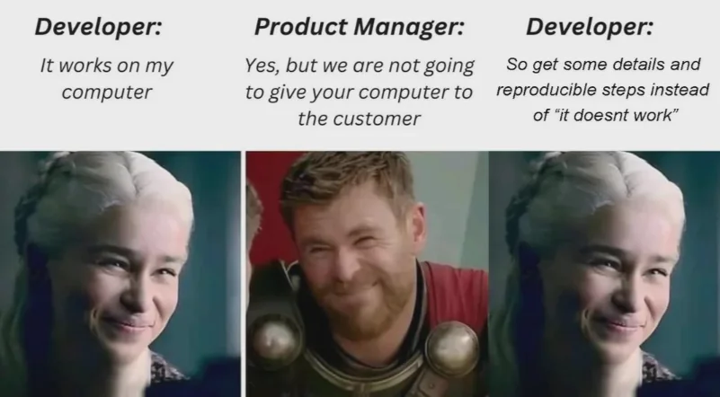
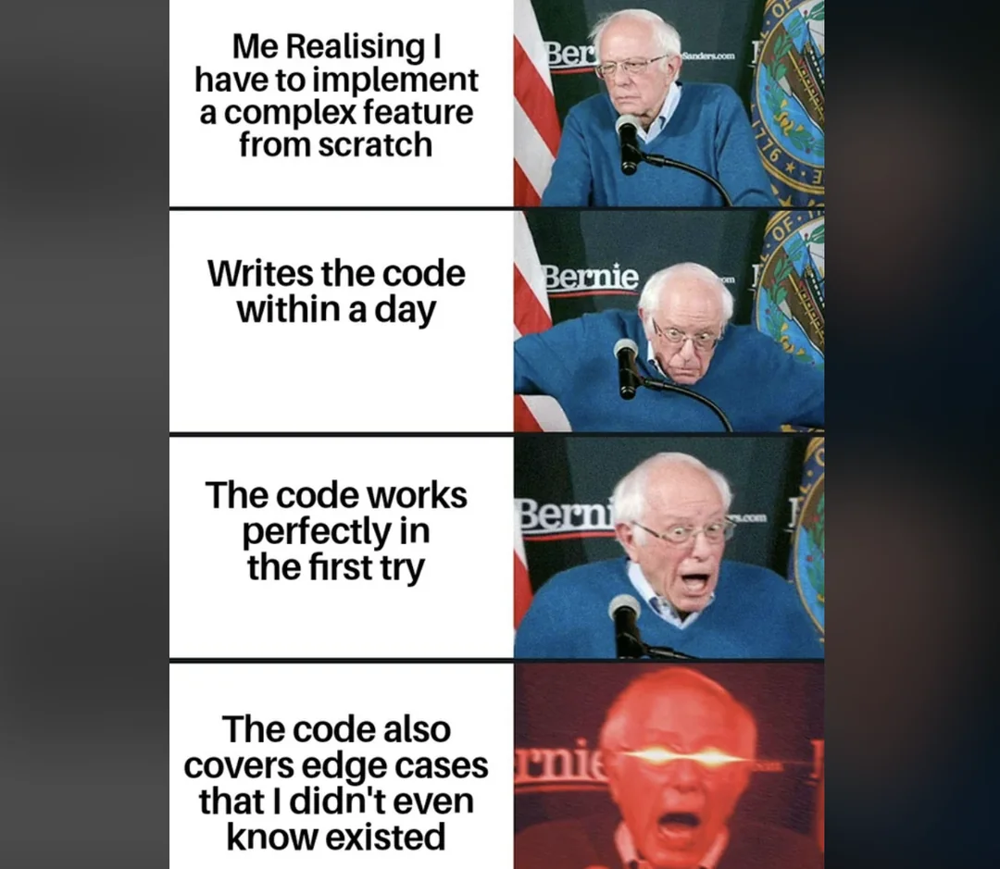
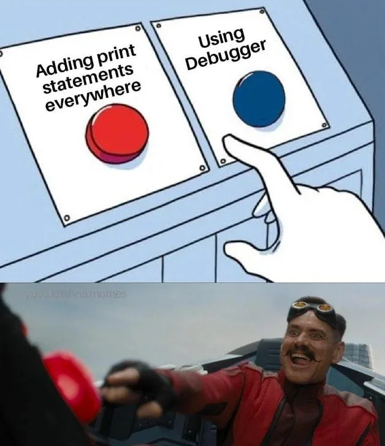

# Gallery

This "chapter" aims to describe common problems encountered during software engineering.
Most images are a courtesy from [Reddit](https://www.reddit.com/r/programmingmemes/).

---

<figure markdown="span">
  { width="600" }
  <figcaption>Don't be this person when reviewing code.</figcaption>
</figure>

---

<figure markdown="span">
  { width="600" }
  <figcaption>Try to keep your documentation up-to-date.</figcaption>
</figure>

---

<figure markdown="span">
  { width="600" }
  <figcaption>Think about testing first, instead of trying to fix bugs after.</figcaption>
</figure>

---

<figure markdown="span">
  { width="600" }
  <figcaption>AI can be useful, but you shouldn't become dependent on it.</figcaption>
</figure>

---

<figure markdown="span">
  { width="600" }
  <figcaption>The root cause of the malfunction will show itself at some point.</figcaption>
</figure>

---

<figure markdown="span">
  { width="600" }
  <figcaption>Always use descriptive variable names, no matter how long it takes.</figcaption>
</figure>

---

<figure markdown="span">
  { width="600" }
  <figcaption>Always think from the perspective of the user.</figcaption>
</figure>

---

<figure markdown="span">
  { width="600" }
  <figcaption>Refactor code when it is needed.</figcaption>
</figure>

---

<figure markdown="span">
  { width="600" }
  <figcaption>Communicate bugs to the developer clearly.</figcaption>
</figure>

---

<figure markdown="span">
  { width="600" }
  <figcaption>In an alternate universe ...</figcaption>
</figure>

---

<figure markdown="span">
  { width="600" }
  <figcaption>Create backups on different machines.</figcaption>
</figure>

---

<figure markdown="span">
  { width="600" }
  <figcaption>Old habits die hard.</figcaption>
</figure>

---

<figure markdown="span">
  { width="600" }
  <figcaption>Keep features small.</figcaption>
</figure>

---

<figure markdown="span">
  { width="600" }
  <figcaption>We've all been there.</figcaption>
</figure>

---

*Most images are a courtesy of [Reddit](https://www.reddit.com/r/programmingmemes/).*
