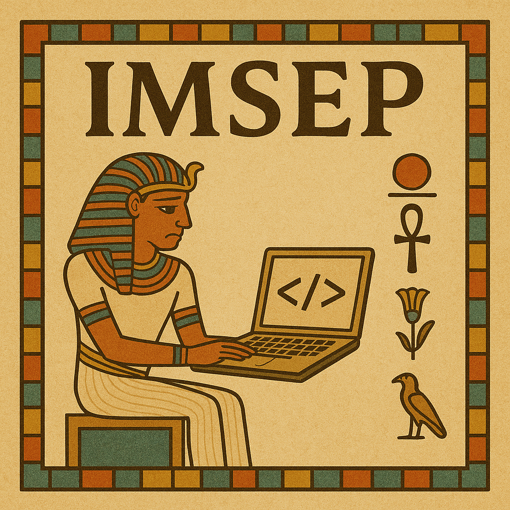

---
hide:
 - toc
 - navigation
---

# 

<figure markdown="span">
  { width="600" }
  <figcaption>Imsep is struggling to develop new software, don't be like Imsep!</figcaption>
</figure>

!!! abstract "Course overview"
    
    This workshop means to introduce the basics of professional software development to PhD students and researchers at QuTech.
    It consists of four parts, each addressing a separate topic. They are meant to be followed in sequence,
    but can be read independently. Each part aims to answer common problems encountered during software development.

    [Chapter 1](./software-development/index.md): Why can't I just follow my own guidelines when working in a team?

    [Chapter 2](./version-control/index.md): How can I contribute code with others in a project?

    [Chapter 3](./dependencies/index.md): Why can't I simply run code from others, and vise versa?

    [Chapter 4](./code-quality/index.md): When I write my own code, I can follow it perfectly, but why is it so difficult to read code from others?

!!! abstract "Prerequisites"

    - Have a machine which runs on Windows / macOS / Ubuntu.
    - Have Git 2+ installed.
    - Have Python 3.10+ installed, and able to understand common syntax (like an if-statement).
