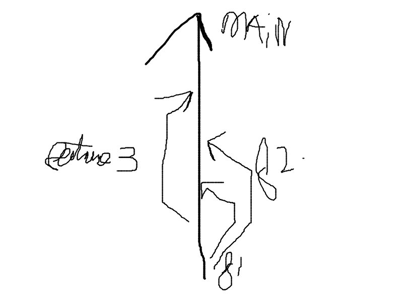
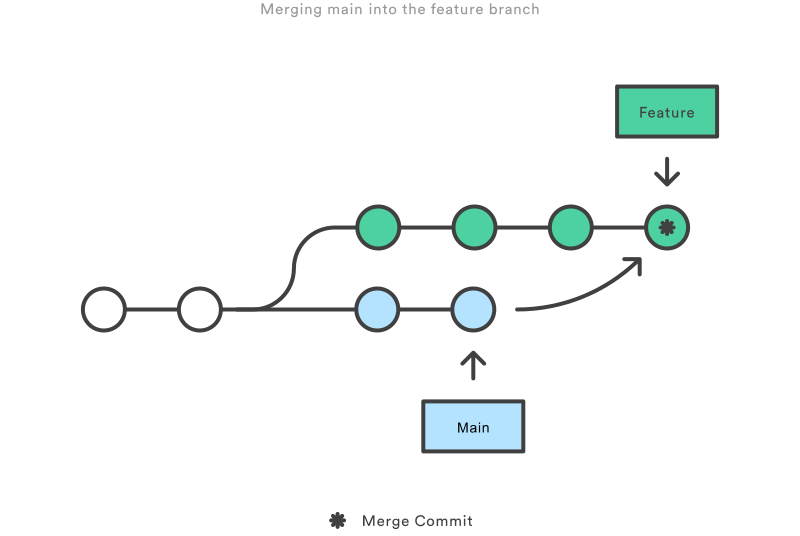
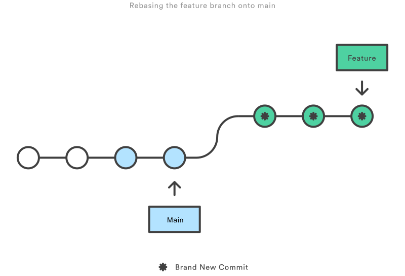
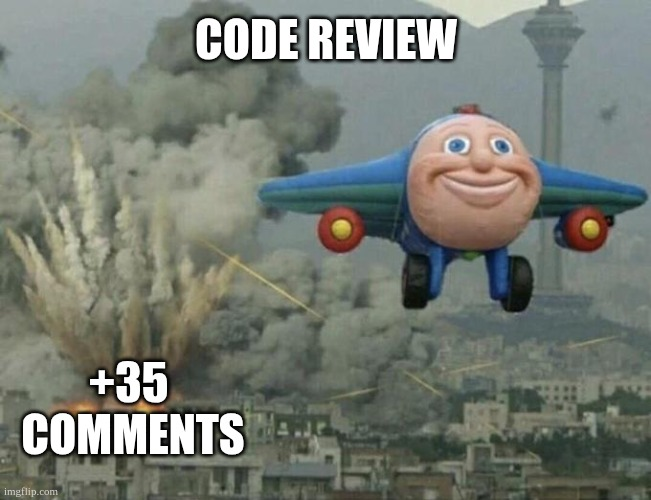

# Advanced development cycle

!!! abstract "Overview"

    - How can a branch model be set up for collaborative development?
    - What are the causes of merge conflicts, and how can they be resolved?
    - How to protect branches, and use merge requests to change them?
    - How to review code from other collaborators?

## Branches

The branch model for collaborative development is pretty much identical to the individual one, the only exception being 
that multiple feature branches can exist at the same time. The idea is that each developer works on an item individually,
and merge with the default branch once it is completed. It is not recommended to have multiple people work in the same branch.
It often leads to conflicts when attempting to push changes. The merging of branches does not have to be done in the order in which they were created, 
as depicted in the image below.

<figure markdown="span">
  { width="600" }
</figure>

!!! info "Question"

    If you want to switch to a branch from another developer, but don't know the name, what command could be used to find it?

??? question "Answer"

    To get both the local and remote branches:

    ```shell
    git branch --all
    ```

    To get the remote branches only:

    ```shell
    git branch --remote
    ```

### Pushing changes

As mentioned above, development is often done in a remote repository, and developers need to push their changes to it.
When commiting changes, only the local branch is affected. The remote version needs to be updated as well. 
In Git, this remote version is called the "origin". When using the `git clone` command, the origin of the default branch is
copied into a local branch, and the configuring is done automatically by Git. This means that, 
in addition to the steps described in the [commit changes](./basic-cycle.md#committing-changes) section in the previous chapter,
the following command automatically updates the origin:

```shell
git push
```

However, when creating local branches, this configuring is not done automatically. E.g., the following sequence of commands will fail,
as Git does not understand where to push to:

```shell
git clone "<URL>"
git switch -c "feature"
git push
```

This can be solved by "connecting" the local and origin versions of a branch with the following command instead:

```shell
git clone "<URL>"
git switch -c "feature"
git push --set-upstream origin "feature"
```

!!! note
    
    The `--set-upstream` flag can be replaced with the short version `-u`.

After this, changes can simply be pushed with the `git push` command. Like changes, deleting a branch only affects the local version.
To delete an origin, use the following command:

```shell
git push origin --delete "feature"
```

!!! note

    The `--delete` flag can be replaced with the short version `-d`.
    Most repository providers have a feature to automatically delete a branch after it is merged.


### Getting up-to-date

As other people could have pushed changes, it is a good habit to check for changes made to the branch.
The first command checks for changes, the second command checks for changes and merges them in the current local branch:

```shell
git fetch
git pull
```

!!! warning

    When working with multiple people in the same branch, or working from multiple devices, e.g. a work laptop and a
    PC at home, the `git pull` command can give rise to a merge conflict if not careful.

#### Merging

Additionally, before a feature branch can be merged, it needs to be "up-to-date" with the changes from the default branch.
In this case, the default branch is first merged into the feature branch. Note that this update is not done with the `git pull` command, 
but rather with `git merge "<DEFAULT>"`. If identical files have changed in both branches, it will lead to a merge conflict.
The process of merging is depicted in the image below.

<figure markdown="span">
  { width="600" }
</figure>

*Courtesy of (stolen from) [Atlassian](https://www.atlassian.com/git/tutorials/merging-vs-rebasing)*

The main upside of merging compared to rebasing (discussed next), is that it is a non-destructive operation.
All the changes made in the default branch which are not yet included in the feature branch are contained in a merge commit.
The doesn't alter the history of the feature branch, and new commits can be made after. The downside is an extra merge commit,
which can pollute the branch history with frequent merges.

#### Rebasing

Instead of merging, the rebase option could be used. With `git rebase "<DEFAULT>"`, the history of the feature branch starts after the last commit from the default branch.
This option provides a much cleaner project history compared to merging, but has to the potential to accidentally re-write history when misused.
A full list of scenarios in which to (not) use rebase can be found [here](https://www.atlassian.com/git/tutorials/merging-vs-rebasing).

<figure markdown="span">
  { width="600" }
</figure>

*Courtesy of (stolen from) [Atlassian](https://www.atlassian.com/git/tutorials/merging-vs-rebasing)*

## Merge conflicts

When Git detects different changes in two different branches, e.g. a feature branch and the default branch, 
or two different versions of the same branch, e.g. a local version and the origin, it warns about a merge conflict. 
Git needs user inputs to resolve the conflict and merge successfully. When executing Git commands from the command-line, 
it will open the [configured](./index.md#configure-git) text editor to resolve the conflicts by hand.

To demonstrate such a conflict, say two developers have been adding changes to the `.gitignore` file. The first developer
merges with the default branch (`main`) without problems. As the second developer tries to merge as well, Git prompts to resolve 
the changes made in both the default and feature branches:

!!! warning "Git"

    ``` text
    CONFLICT (content): Merge conflict in .gitignore
    Automatic merge failed; fix conflicts and then commit the result.
    ```

During the merge, the `.gitignore` file will look like this:

!!! note ".gitignore"

    ```text
    <<<<<<< HEAD
    change(s) from second developer
    =======
    change(s) from first developer
    >>>>>>> main
    ```

`<<<<<<< HEAD` marks the start of the changes in the current branch. For the second developer, this would be the local feature branch. 
`=======` marks the end of the changes in the current branch, and the start of the changes made in the other branch (`main`).
`>>>>>>> main` marks the end of the other changes.

It is up to the second developer to resolve the conflict, by editing the `.gitignore` file and marking the issue as resolved.
This can be done by editing the file in a text editor or in the GUI provided by an IDE. In both cases, the file should look like this in the end:

!!! note ".gitignore"

    ```text
    change(s) from first developer
    change(s) from second developer
    ```

Note that the mark blocks like `<<<<<<< HEAD` have to be manually removed. After, the standard procedure for commiting changes can be followed,
and the conflict is resolved. When merge conflicts get more complex, e.g. between blocks of code, and across multiple files, a GUI can be preferred. 
It usually excels in giving an overview of what needs to be fixed where compared to the command-line.

## Merge requests

In collaborative repositories, the default branch should be protected. This means no changes can be directly pushed to it,
and merges can only occur when certain conditions have met, e.g. an approval after a [code review](#code-reviews).
A merge request can be opened through a GUI in the remote repository. This can be a webpage, via an IDE, or a separate program,
depending on the provider. Keep in mind that even though a merge request is closely connect to Git, it is not a feature of Git.
The name of the request can also differ across providers. In GitHub, it is known as a pull request.

The merge request can be coupled to a CI/CD pipeline, which is an automated execution
of a number of tasks. This can be a task which runs the code tests, checks the dependencies etc. 
Setting up such a pipeline is beyond the scope of this workshop. An open merge request is a sign for other developers that the suggested changes can be reviewed.

Once the merge request is set to merge, it usually triggers a few Git commands, depending on the configuration of the repository:

- It merges the feature branch into the default branch, usually as a squash commit. This means all commits done in the feature branch
  (including merge commits) are "squashed" into a single commit. This greatly helps to track the history of the default branch.
- As mentioned before, it can automatically delete the feature branch.
- The merge request is closed.

## Code reviews

Depending on the maturity of the project and/or developers, the code review can serve multiple functions. 
[Mature](../software-development/index.md#software-development-maturity) projects allows reviews to focus on their primary purpose, namely checking 
if the suggested change(s) are optimal with respect to the desired feature(s) and if it could lead to unforeseen problems.

When reviewing codes from inexperienced developers, or vise versa, it could be useful to understand the syntax, 
and simply ask questions about what is happening. This way, either of them can learn something new, and the proficiency of the team increases. 
Immature projects require extensive reviews, which can include the following additional items:

- understanding the philosophy behind the changes.
- writing and running tests to check for breaking changes.
- checking syntax.

Especially teams that do not have [code quality](../clean-code/index.md) standards defined beforehand, can have comments related to code style and usage of dependencies.
As these are often made as comments online, it is common to them concise and to the point. However, this could be perceived as pedantic, 
and even a little patronising when receiving a few of these comments in sequence. For example:

1. "function names must be lowercase"
2. "docstring does not include parameters"
3. "why don't you use Path library here?"

Code reviews are for the most part about the bigger picture. If there are consistent patterns throughout multiple comments, 
it can be better to summarise it in a single one, or make the remark in-person.
There can also be remarks that are far from tedious, and have a large impact on the suggested changes. In this scenario,
it can be also beneficial to have a small meeting in-person, instead of writing an extensive comment. 
In summary, don't do this:

<figure markdown="span">
  { width="600" }
</figure>

## Further reading

In the merge request section, squash commits were mentioned. This is one example of the many other kinds of "exotic" commits available in Git.
Setting up such a commit, is beyond the scope of this workshop, but tutorials can be found [online](https://stackoverflow.com/questions/5189560/how-do-i-squash-my-last-n-commits-together).

Additionally, software projects usually have a ticket system for bugs, tasks, etc. 
Branches and merge requests belonging to the ticket are automatically coupled for convenience for the developers.
The tickets can be managed by the same provider as the repository, but this doesn't have to be the case, 
like [Jira](http://jira.tudelft.nl/), used for QuTech's software projects.
